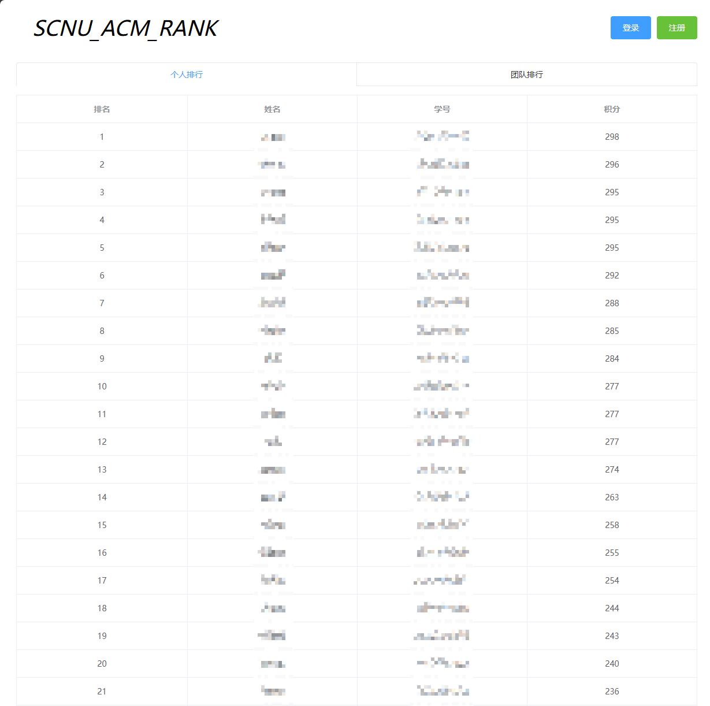

# scnu_acm_rank_front

**README [English](./README.md) | [中文](../README.md)**

`SCNU_ACM_RANK` is a ranking website for the South China Normal University Artificial Intelligence College ACM team and its members, and this repository is for the front-end.

The purpose of this website is to enhance students' enthusiasm for ICPC and CCPC algorithm competitions.

This website is developed using `Vue2` and designed with `ElementUI` for UI.

The backend repository is located at: [SCNU_ACM_RANK](https://github.com/yyym-y/scnu_acm_rank), and the Rank website is https://acmrank.socoding.cn.

### Help Documentation

If you have any questions or encounter any bugs, please raise an issue in this repository.

* [Deployment Instructions](./load_en.md)
* [Secondary Development Documentation](./second-dev_en.md)

### Page Display

